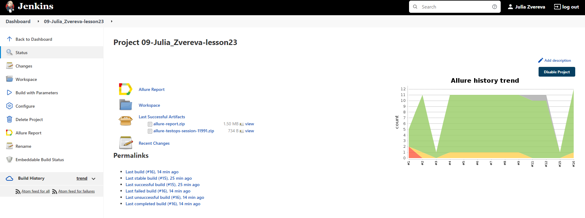

# Автотесты для [book24.ru](https://book24.ru)

## Cписок проверок:

##UI

- [x] В заголовке страницы товара содержится название товара
- [x] На странице товара присутствует название товара
- [x] Кнопка добавления в корзину на странице товара меняет текст на 'Оформить заказ' после добавления товара в корзину
- [x] В заголовке страницы корзины должно содержаться 'Корзина'
- [x] Отображение наименования товара в корзине
- [x] Увеличение количества товара в корзине
- [x] Уменьшение количества товара в корзине
- [x] Удаление товара из корзины

##API

- [x] Фильтр книг по издательству выдает книги только этого издательства
- [x] Фильтр книг по печати по требованию выдает только книги, печатаемые по требованию
- [x] В списке предложений, выдаваемых при вводе поискового запроса, присутствует соответствующий запросу товар
- [x] Товар добавляется в корзину

# Стек технологий


## Для запусков автотестов используется Jenkins.

##### Пример готовой сборки можно посмотреть [по ссылке](https://jenkins.autotests.cloud/job/09-Julia_Zvereva-lesson23/)

### Параметры запуска в Jenkins


### Статистика запусков в Jenkins


### Отчёт о прохождении автотестов в Allure Report


### Список автотестов в Allure Report


### Хранение тестовой документации в Allure TestOps


### Прохождение тестов в Allure TestOps


### Уведомления о прохождении автотестов в Telegram


### Видео о прохождении тестов


### Для запуска локально
```
gradle clean test
```

### Для запуска удаленно
```bash
clean
test
-Dbrowser=${BROWSER}
-DbrowserVersion=${BROWSER_VERSION}
-DbrowserSize=${BROWSER_SIZE}
-DbrowserMobileView="${BROWSER_MOBILE}"
-DremoteDriverUrl=${REMOTE_DRIVER_URL}
-DvideoStorage=https://${REMOTE_DRIVER_URL}/video/
-Dthreads=${THREADS}
```
